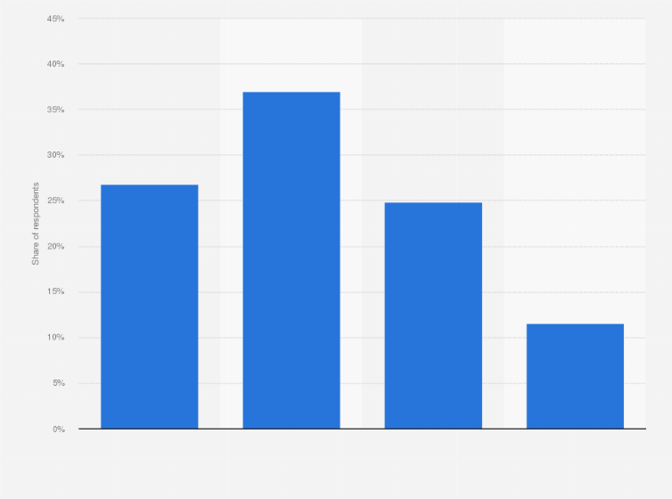

# Perky Plants

## Creator

Hello, my name is Ralph Mariano and I currently attend UC Berkeley as a Chemical Biology Major. I'm also a part of the SEED Scholars Program which focuses on undergraduate research.

## Description

Perky plants is incredibly committed to spreading the goodness of people looking at plants in the comfort of your own home. Beyond adding some green to your off-colored houses, it actually has some psychological benefits... provided that you can keep it alive. Most people kill plants. Just look at this data visualization.

## Our Favorite Perky Plants

Some of our favorite plants are the Thai Constellation Monstera, Silver Dragon Alocasia, and the Pink Princess Philodendron. Take a look!

**Yeah!**
*Italics*
